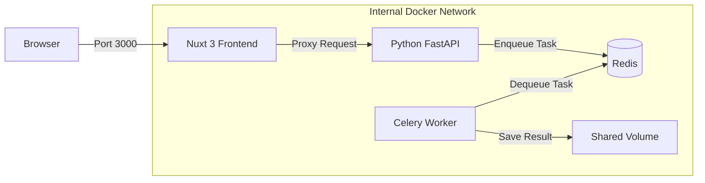
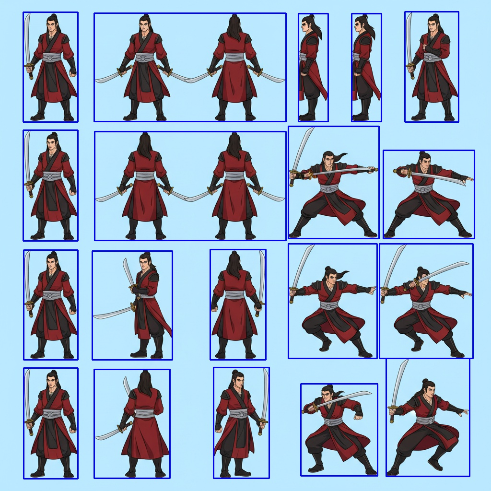

# Sprite Service | 自動化 Sprite 處理服務

[](https://opensource.org/licenses/MIT)

[English Documentation](#english-documentation) | [繁體中文說明](#繁體中文說明)

---

## English Documentation

### 1. Overview
**Sprite Service** is a microservice-based application designed to automate the processing of game assets (sprites). It leverages AI to remove backgrounds, intelligently splits connected regions into individual sprites, and resizes them into multiple standard formats.

The project features a secure **Backend-for-Frontend (BFF)** architecture, where the core API is isolated from the public network and accessible only through a secure Nuxt 3 frontend gateway.

### 2. Key Features
*   **AI Background Removal**: Uses **BiRefNet (Normal)** for high-precision, edge-preserving background removal (provides the highest quality masks).
*   **Smart Splitting**: Automatically detects and separates multiple sprite elements from a single source image using OpenCV.
*   **Multi-Size Generation**: Auto-resizes sprites into standard presets (Large, Medium, Small) with proper centering and padding.
*   **Secure Architecture**:
    *   **BFF Pattern**: The Python API is hidden inside the Docker network.
    *   **Proxy Gateway**: All external requests go through the Nuxt 3 frontend.
*   **User-Friendly Interface**: Modern Web UI built with **Nuxt UI** supporting drag-and-drop uploads and real-time status polling.
*   **Asynchronous Processing**: Uses **Celery + Redis** to handle heavy image processing tasks in the background without blocking the UI.

### 3. System Architecture



### 4. Tech Stack
*   **Frontend**: Nuxt 3, Nuxt UI, TypeScript, Tailwind CSS.
*   **Backend API**: Python 3.9, FastAPI/Uvicorn.
*   **Worker**: Celery, PyTorch, BiRefNet (HuggingFace), OpenCV.
*   **Infrastructure**: Podman/Docker Compose.

### 5. Getting Started

#### Prerequisites
*   **Podman** (recommended) or **Docker**.
*   **Podman Compose** or **Docker Compose**.
*   Git.

#### Installation & Running
1.  **Clone the repository**:
    ```bash
    git clone <repository_url>
    cd sprite_service
    ```

2.  **Start Services**:
    ```bash
    # Using Podman
    podman-compose up -d --build

    # Using Docker
    docker-compose up -d --build
    ```
    *Note: The first launch will download the AI model and base images, which may take a few minutes.*

3.  **Scaling Worker Service (Optional)**:
    You can scale the worker service to process multiple tasks in parallel:
    ```bash
    # Scale to 3 workers using Podman
    podman-compose up -d --scale worker=3

    # Scale to 3 workers using Docker
    docker-compose up -d --scale worker=3
    ```

4.  **Access the Application**:
    *   Open your browser and navigate to: **http://localhost:3000**
    *   (The internal API at port 8000 is intentionally unreachable directly).

### 6. Example Showcase
We generated a Wuxia swordman character sheet using AI image generation (from text prompt) and processed it through Sprite Service.

**Input Prompt**: "Generate a set of swordman sprites for a Wuxia game, including various angles, in anime/cartoon style (not pixel art)..." (See `example/prompt.txt`)

| Original Image | Background Removal | Sprite Detection |
| :---: | :---: | :---: |
|  |  |  |

**Output Results**:
| Large (256px) | Medium (128px) | Small (64px) |
| :---: | :---: | :---: |
|  |  |  |

*(See `example/` directory for full output)*

### 7. Development Guide

#### Directory Structure
```
sprite_service/
├── api/                # FastAPI Backend Service
├── worker/             # Celery Worker (AI Processing)
│   ├── checkpoints/    # Model weights
│   └── sprite_processor.py # Core logic
├── frontend/           # Nuxt 3 Frontend Application
├── android_app/        # Android Mobile Application
├── docker-compose.yml  # Container Orchestration
└── api_test_script.py  # Automation Test Script
```

#### Running Tests
An automated script is provided to verify the full pipeline (upload -> process -> download):
```bash
python3 api_test_script.py
```

#### Android Development
For Android app development instructions, please refer to [android_app/README.md](android_app/README.md) and [android_app/SETUP.md](android_app/SETUP.md).

#### Troubleshooting
*   **Memory Issues**: The worker uses the full `BiRefNet` model for best quality, which requires at least **8GB+ RAM**. Ensure your Docker/Podman machine has sufficient memory allocated.
*   **Connection Refused**: Ensure you are accessing port `3000`, not `8000`.

---

## 繁體中文說明

### 1. 專案概述
**Sprite Service** 是一個基於微服務架構的自動化圖像處理系統，專為遊戲開發資產 (Sprite) 設計。它利用 AI 技術自動移除背景、智慧切割連通區域，並將圖片輸出為多種標準尺寸。

本專案採用安全的 **Backend-for-Frontend (BFF)** 架構，核心 API 隱藏於內部網路，僅能透過 Nuxt 3 前端介面進行存取，確保系統安全性。

### 2. 功能特色
*   **AI 智慧去背**: 採用 **BiRefNet (完整版)** 模型，提供最高精度的邊緣去背與遮罩品質。
*   **智慧切割**: 使用 OpenCV 自動偵測並分離單張圖片中的多個 Sprite 元素。
*   **多尺寸輸出**: 自動將切割後的 Sprite 調整為標準尺寸 (大/中/小) 並置中補白。
*   **安全架構**:
    *   **BFF 模式**: Python API 隱藏於 Docker 內部網路，不對外公開。
    *   **代理閘道**: 所有外部請求皆需經過 Nuxt 3 前端進行驗證與轉發。
*   **現代化介面**: 使用 **Nuxt UI** 打造的 Web 介面，支援拖曳上傳與即時進度顯示。
*   **非同步處理**: 使用 **Celery + Redis** 佇列處理耗時的影像運算，確保介面操作流暢。

### 3. 系統架構

| 服務組件 | 技術堆疊 | 說明 |
| :--- | :--- | :--- |
| **Frontend** | Nuxt 3, Vue 3 | 提供使用者介面與 API 安全代理 (Port 3000)。 |
| **API** | Python FastAPI | 接收內部請求並派發任務 (內部 Port 8000)。 |
| **Worker** | Celery, PyTorch | 執行實際的 AI 去背與影像處理運算。 |
| **Broker** | Redis | 負責任務排程與狀態同步。 |

### 4. 快速開始

#### 事前準備
*   安裝 **Podman** (推薦 macOS 使用) 或 **Docker**。
*   安裝 **Podman Compose** 或 **Docker Compose**。
*   安裝 Git。

#### 安裝與執行
1.  **取得專案代碼**:
    ```bash
    git clone <repository_url>
    cd sprite_service
    ```

2.  **啟動服務**:
    ```bash
    # 使用 Podman
    podman-compose up -d --build

    # 使用 Docker
    docker-compose up -d --build
    ```
    *注意：首次啟動需要下載 AI 模型與基礎映像檔，可能需要 5-10 分鐘。*

3.  **擴展 Worker 服務 (可選)**:
    您可以擴展 worker 服務以並行處理多個任務：
    ```bash
    # 使用 Podman 擴展至 3 個 worker
    podman-compose up -d --scale worker=3

    # 使用 Docker 擴展至 3 個 worker
    docker-compose up -d --scale worker=3
    ```

4.  **使用服務**:
    *   開啟瀏覽器並前往: **http://localhost:3000**
    *   (基於安全考量，Port 8000 的 API 無法直接連線，請務必透過前端操作)。

### 5. 成果範例
以下展示使用文生圖模型生成武俠遊戲劍客素材，並經由 Sprite Service 自動化處理的成果。

**提示詞 (Prompt)**: 「我需要一組提示詞能夠讓生圖模型產生武俠遊戲中的劍客 sprites (一張圖中要有這個劍客所需的個個角度 sprite 資源，並方便切割） 不是像素風格，是動畫卡通風格」(完整內容請見 `example/prompt.txt`)

| 原始生成圖 | AI 去背預覽 | Sprite 偵測 |
| :---: | :---: | :---: |
|  |  |  |

**輸出 Sprite**:
| 大 (Large) | 中 (Medium) | 小 (Small) |
| :---: | :---: | :---: |
|  |  |  |

*(完整輸出請見 `example/` 目錄)*

### 6. 開發指南

#### 專案結構說明
```
sprite_service/
├── api/                # FastAPI 後端服務 (僅限內部存取)
├── worker/             # Celery Worker (核心 AI 處理邏輯)
│   ├── checkpoints/    # 模型權重檔
│   └── sprite_processor.py # 影像處理核心程式碼
├── frontend/           # Nuxt 3 前端應用程式 (包含 UI 與 Server Proxy)
├── android_app/        # Android 行動應用程式
├── docker-compose.yml  # 容器編排設定檔
└── api_test_script.py  # 自動化測試腳本
```

#### 測試方式
專案內附帶一個自動化測試腳本，可用於驗證完整流程 (上傳 -> 處理 -> 下載)：
```bash
python3 api_test_script.py
```
該腳本會透過前端 API (Port 3000) 發送請求，模擬真實使用者行為。

#### Android 開發
關於 Android 應用程式的開發說明，請參考 [android_app/README.md](android_app/README.md) 與 [android_app/SETUP.md](android_app/SETUP.md)。

#### 常見問題排除
*   **記憶體不足 (OOM)**: Worker 目前使用完整版 `BiRefNet` 模型以確保去背品質，建議配置至少 **8GB+ RAM** 的環境 (請調整 Docker/Podman Machine 的記憶體設定)。
*   **無法連線到 API**: 這是正常的安全設計。請不要嘗試連線 `localhost:8000`，所有請求都應發送至 `localhost:3000`。
